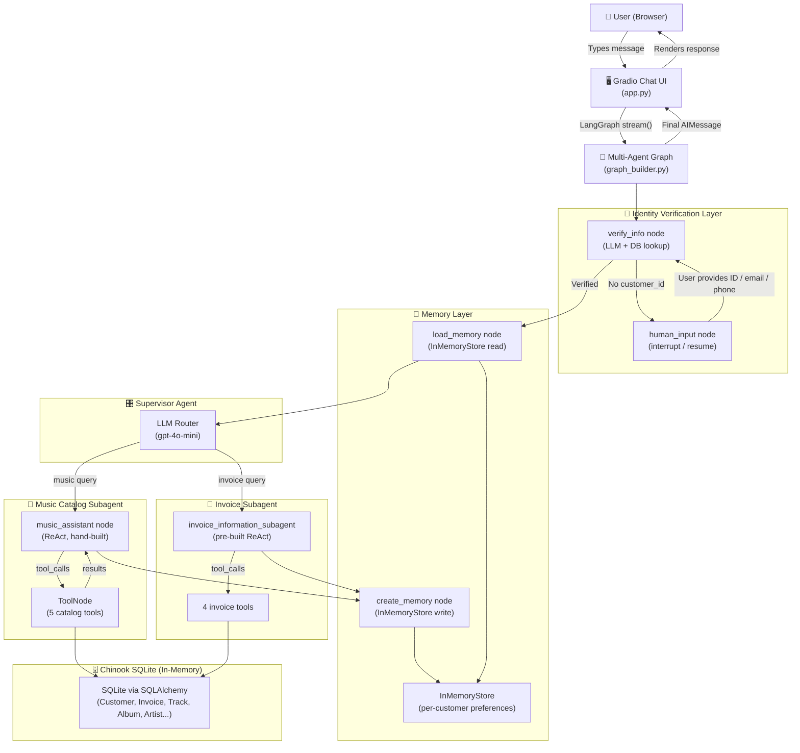

# 🎵 Music Store Multi-Agent System

> A production-ready, LangGraph-powered multi-agent AI assistant for a digital music store — supporting natural language catalog discovery, invoice lookup, customer verification with human-in-the-loop, and long-term personalized memory.

---

## 📖 Overview

The **Music Store Multi-Agent System** is an intelligent customer support chatbot built on top of the [Chinook sample database](https://github.com/lerocha/chinook-database) — a realistic digital music store dataset containing artists, albums, tracks, customers, and invoices.

### Why it exists

Modern customer support tools are either too rigid (keyword-based bots) or too generic (LLMs without business context). This project bridges the gap by combining:

- **Structured data access** via parameterized SQL queries on a real relational database
- **Multi-agent orchestration** via LangGraph to route tasks to specialist agents
- **Persistent, personalized memory** to remember each customer's music preferences across sessions
- **Human-in-the-loop verification** to securely gate account-specific operations behind identity checks

### Real-world use case

A customer visits the music store chatbot. They can:
1. **Browse the catalog** — ask about genres, artists, albums, or specific songs without any login
2. **Access their account** — after verifying identity (Customer ID / email / phone), they can look up past invoices, see what they purchased, and find out who their support rep was
3. **Get personalized suggestions** — the system remembers their music preferences and surfaces relevant results automatically on future visits

---

## ✨ Features

- 🤖 **Multi-agent architecture** — Supervisor routes queries to specialist subagents (music catalog vs. invoice lookup)
- 🔐 **Customer verification with human-in-the-loop** — Identity must be confirmed before account data is exposed; supports Customer ID, email address, and phone number lookup
- 🧠 **Long-term memory** — Music preferences are persisted per customer across sessions using LangGraph's `InMemoryStore`
- 🎶 **Music catalog agent** — Hand-built ReAct agent for searching artists, albums, tracks, and genres with fuzzy matching
- 🧾 **Invoice information agent** — Pre-built ReAct agent for retrieving purchase history, invoice totals, line items, and support rep details
- 🛡️ **SQL injection protection** — All queries use SQLAlchemy parameterized `text()` bindings
- 📞 **Phone number normalization** — Strips formatting characters to match numbers regardless of how they were stored
- 📧 **Case-insensitive email matching** — Prevents missed lookups due to capitalization differences
- 🗄️ **Local SQL bundling with GitHub fallback** — Ships with the Chinook SQL file locally; falls back to live GitHub download if missing
- 💬 **Gradio chat UI** — Clean, responsive chat interface with status indicators, session management, and one-click conversation reset
- 📊 **Structured logging** — Every tool call, DB lookup, and agent event is logged with context for observability
- ⚙️ **Fully configurable via environment variables** — Model name, temperature, API base URL, and port are all env-driven

---

## 🛠️ Tech Stack

| Layer | Technology |
|---|---|
| **Language** | Python 3.10+ |
| **UI Framework** | [Gradio](https://gradio.app/) >= 5.0 |
| **Agent Orchestration** | [LangGraph](https://langchain-ai.github.io/langgraph/) >= 1.0 |
| **Supervisor** | [langgraph-supervisor](https://pypi.org/project/langgraph-supervisor/) |
| **LLM Provider** | [LangChain OpenAI](https://python.langchain.com/docs/integrations/llms/openai) (compatible with any OpenAI-spec endpoint) |
| **Default Model** | `gpt-4o-mini` (configurable) |
| **Database** | SQLite (in-memory) via [SQLAlchemy](https://www.sqlalchemy.org/) 2.0 |
| **DB Abstraction** | LangChain `SQLDatabase` utility |
| **Data Validation** | [Pydantic](https://docs.pydantic.dev/) v2 |
| **Memory** | LangGraph `InMemoryStore` + `MemorySaver` checkpointer |
| **Dataset** | [Chinook Sample Database](https://github.com/lerocha/chinook-database) |
| **Env Config** | `python-dotenv` |
| **HTTP** | `requests` (for SQL script download fallback) |

---

## 🏗️ Architecture Diagram



---

## ⚙️ System Flow / Working

Here is a step-by-step walkthrough of what happens from the moment a user types a message to receiving a response:

### Step 1 — User sends a message
The Gradio UI captures the message, immediately appends it to the chat history (for responsiveness), and transitions the status bar to "Processing...". The actual graph invocation happens asynchronously in a second Gradio event.

### Step 2 — Thread isolation
Each browser session has a unique `thread_id` (UUID). This is passed as `configurable.thread_id` to LangGraph, which uses it to scope the `MemorySaver` checkpointer. Conversations are completely isolated between sessions.

### Step 3 — Graph entry: `verify_info` node
The `multi_agent` graph always starts at `verify_info`. This node:
- Checks if `state["customer_id"]` is already populated (i.e., identity was confirmed in a previous turn of this session). If so, it passes through immediately.
- Otherwise, it uses an LLM with structured output (`UserInput` schema) to extract any identifier from the message (Customer ID number, email address, or phone number).
- It runs a parameterized SQL lookup against the Chinook `Customer` table — trying numeric ID, then email (case-insensitive), then phone (normalized).
- If found, it injects a `SystemMessage` into the conversation with the verified `customer_id` and saves it to state.
- If not found, it generates a polite prompt asking the user to provide their credentials.

### Step 4 — Human-in-the-loop interrupt
If `customer_id` is still `None` after `verify_info`, the conditional edge routes to `human_input`, which calls `langgraph.types.interrupt()`. This pauses the graph and returns control to the UI. The next message the user sends resumes the graph from this checkpoint, feeding the new message back into `verify_info`.

### Step 5 — Memory load
Once verified, the graph moves to `load_memory`. This reads from `InMemoryStore` using the namespace `("memory_profile", customer_id)`. If preferences exist (from a past session), they are formatted as a string and stored in `state["loaded_memory"]`.

### Step 6 — Supervisor routing
The supervisor LLM receives the full conversation context (including the injected `customer_id` system message and loaded memory). It decides:
- **Music query** → delegates to `music_catalog_subagent`
- **Invoice query** → delegates to `invoice_information_subagent`
- **Mixed query** → delegates invoice first, then music
- **Off-topic** → responds directly without calling any subagent

### Step 7 — Subagent execution (ReAct loop)
Each subagent runs its own ReAct (Reason + Act) loop:
- **Music Catalog Subagent**: A hand-built LangGraph subgraph. The LLM decides which tool to call, the `ToolNode` executes the SQL query, and results are fed back to the LLM until no more tool calls are needed.
- **Invoice Subagent**: A pre-built `create_react_agent` from LangGraph prebuilt. Same loop pattern, using the 4 invoice tools.

### Step 8 — Memory save
After the supervisor finishes, the `create_memory` node runs. It analyzes the last 10 messages of the conversation, extracts any **explicitly expressed** music preferences, merges them with existing stored preferences, and writes the updated `UserProfile` back to `InMemoryStore`.

### Step 9 — Response delivery
The graph streams events back to `app.py`. The `generate_response` function iterates over graph events, captures the last `AIMessage` content, and appends it to the Gradio chat history. The status bar updates to show elapsed time and which data sources were used.

---

## 📂 Folder Structure

```
music-store-agent/
│
├── app.py                  # Gradio UI: chat interface, event handlers, session management
├── graph_builder.py        # LangGraph graph assembly: nodes, edges, subagents, compilation
├── nodes.py                # All node functions: verification, memory, music assistant, conditionals
├── tools.py                # LangChain @tool definitions: 5 music + 4 invoice tools
├── prompts.py              # All system prompts for every agent and subagent
├── state.py                # TypedDict State schema shared across the entire graph
├── models.py               # Pydantic models: UserInput (extraction) and UserProfile (memory)
├── database.py             # SQLite setup, SQL loading, query execution, phone normalization
│
├── Chinook_Sqlite.sql      # (Optional) Local copy of Chinook SQL script — auto-downloaded if missing
├── requirements.txt        # Python dependencies
├── .env                    # (Not committed) Environment variables
└── README.md               # This file
```

### Key file responsibilities

| File | Role |
|---|---|
| `app.py` | Entry point. Runs Gradio server. Calls `initialize()` on startup. Handles two-step send (show message → get response) for perceived responsiveness. |
| `graph_builder.py` | Single function `build_graph()` that wires together all nodes, conditional edges, subagents, and compiles the final LangGraph. Returns `(graph, checkpointer, store)`. |
| `nodes.py` | Contains every node function as a factory (`create_*`) or direct function. Includes `get_customer_id_from_identifier()` — the core identity resolution logic. |
| `tools.py` | 9 `@tool`-decorated functions. Each logs its call and result. All use `run_query_safe()` for parameterized SQL. |
| `prompts.py` | Single source of truth for all prompts. Every agent's behavior (grounding rules, scope, routing rules) is defined here. |
| `state.py` | Defines `State` TypedDict with `customer_id`, `messages` (with `add_messages` reducer), `loaded_memory`, and `remaining_steps`. |
| `models.py` | `UserInput` for LLM-structured identifier extraction. `UserProfile` for memory persistence. |
| `database.py` | Loads Chinook SQL (local first, GitHub fallback), creates in-memory SQLite engine, exposes `run_query_safe()` and `normalize_phone()`. |

---

## 🚀 Installation & Setup

### Prerequisites

- Python 3.10 or higher
- An OpenAI API key (or a compatible endpoint, e.g., Azure OpenAI, Groq, LM Studio)
- `pip` and `venv` (recommended)

### 1. Clone the repository

```bash
git clone https://github.com/your-username/music-store-agent.git
cd music-store-agent
```

### 2. Create and activate a virtual environment

```bash
# Create virtual environment
python -m venv venv

# Activate (Linux / macOS)
source venv/bin/activate

# Activate (Windows)
venv\Scripts\activate
```

### 3. Install dependencies

```bash
pip install -r requirements.txt
```

> **Note:** `langgraph-supervisor` is a key dependency. If it fails to install, check that you have a recent version of `langgraph` installed first.

### 4. Configure environment variables

Create a `.env` file in the project root:

```bash
cp .env.example .env   # If example exists, otherwise create manually
```

Edit `.env`:

```env
# Required
OPENAI_API_KEY=sk-your-api-key-here

# Optional overrides
OPENAI_API_BASE=            # Leave blank for OpenAI. Set for Azure/Groq/local
MODEL_NAME=gpt-4o-mini      # Default model
TEMPERATURE=0               # 0 = deterministic (recommended)
PORT=7860                   # Gradio server port
```

### 5. (Optional) Pre-download the Chinook database

The app will auto-download `Chinook_Sqlite.sql` from GitHub on first run if the file is not present locally. To pre-download it:

```bash
curl -o Chinook_Sqlite.sql \
  "https://raw.githubusercontent.com/lerocha/chinook-database/master/ChinookDatabase/DataSources/Chinook_Sqlite.sql"
```

### 6. Run the application

```bash
python app.py
```

The Gradio interface will be available at: **http://localhost:7860**

You should see startup logs like:
```
INFO | database | Chinook database loaded successfully into memory.
INFO | graph_builder | Music catalog sub agent compiled.
INFO | graph_builder | Invoice information sub agent compiled.
INFO | graph_builder | Supervisor compiled.
INFO | graph_builder | Final multi agent graph compiled successfully.
```

---

## 🔐 Environment Variables

| Variable | Required | Default | Description |
|---|---|---|---|
| `OPENAI_API_KEY` | ✅ Yes | — | Your OpenAI (or compatible) API key |
| `OPENAI_API_BASE` | ❌ No | `""` | Custom API base URL. Leave blank for OpenAI. Use for Azure, Groq, LM Studio, etc. |
| `MODEL_NAME` | ❌ No | `gpt-4o-mini` | Chat model to use. Must support tool/function calling. |
| `TEMPERATURE` | ❌ No | `0` | LLM temperature. `0` = deterministic, higher = more creative |
| `PORT` | ❌ No | `7860` | Port for the Gradio server |

### Using alternative LLM providers

The system is compatible with any OpenAI-spec-compliant API. Examples:

```env
# Groq (fast inference)
OPENAI_API_KEY=gsk_your_groq_key
OPENAI_API_BASE=https://api.groq.com/openai/v1
MODEL_NAME=llama-3.1-70b-versatile

# Azure OpenAI
OPENAI_API_KEY=your_azure_key
OPENAI_API_BASE=https://your-resource.openai.azure.com/
MODEL_NAME=gpt-4o-mini  # Your deployment name

# Local LM Studio
OPENAI_API_KEY=lm-studio
OPENAI_API_BASE=http://localhost:1234/v1
MODEL_NAME=local-model
```

---

## 🤖 AI / Agent Logic

### Multi-Agent Graph Overview

The system is built as a hierarchical multi-agent LangGraph. There are three levels:

```
multi_agent (outer graph)
├── verify_info          ← Identity gate
├── human_input          ← Interrupt node
├── load_memory          ← Preference loading
├── supervisor           ← Compiled subgraph (router)
│   ├── music_catalog_subagent    ← Compiled subgraph (hand-built ReAct)
│   │   ├── music_assistant       ← LLM with bound tools
│   │   └── music_tool_node       ← ToolNode (5 tools)
│   └── invoice_information_subagent  ← Pre-built create_react_agent
│       └── invoice tools (4 tools)
└── create_memory        ← Preference saving
```

### Agent: Music Catalog Subagent

A **hand-built ReAct agent** implemented as a mini LangGraph with two nodes:

- `music_assistant`: Invokes the LLM (with 5 tools bound). Receives the system prompt (including loaded memory), a customer_id system message (if available), and the full message history. Returns an `AIMessage` that may contain tool calls.
- `music_tool_node`: A LangGraph `ToolNode` that executes whatever tool the LLM called and returns `ToolMessage` results.

The loop continues (`music_assistant → music_tool_node → music_assistant`) until the LLM produces a response with no tool calls, at which point the `should_continue` edge returns `"end"`.

**Grounding rules** in the music assistant prompt prevent the LLM from hallucinating catalog data — it must call a tool before answering any catalog question.

### Agent: Invoice Information Subagent

A **pre-built ReAct agent** using LangGraph's `create_react_agent`. The system prompt (`INVOICE_SUBAGENT_PROMPT`) explicitly instructs the agent to:
- Look for the verified `customer_id` in the system message injected during verification (never extract it from user text)
- Use only tool-returned data (never fabricate invoice amounts, dates, or track lists)

### Supervisor Agent

Built with `langgraph_supervisor.create_supervisor()`. It receives the full conversation (including all system messages) and decides which subagent(s) to call. The supervisor prompt defines explicit routing rules:
- Music queries → `music_catalog_subagent`
- Invoice queries → `invoice_information_subagent`
- Mixed queries → invoice first, then music
- Off-topic queries → direct refusal (no subagent called)

### Tool Inventory

#### Music Catalog Tools (5 tools)

| Tool | Description | Key SQL tables |
|---|---|---|
| `get_albums_by_artist(artist)` | Fuzzy search albums by artist name | `Album`, `Artist` |
| `get_tracks_by_artist(artist)` | Returns up to 20 full-detail tracks by artist | `Track`, `Album`, `Artist`, `Genre`, `MediaType` |
| `get_songs_by_genre(genre)` | One representative track per artist for a genre (up to 10) | `Track`, `Genre`, `Album`, `Artist` |
| `check_for_songs(song_title)` | Fuzzy search tracks by song title | `Track`, `Album`, `Artist`, `Genre` |
| `get_track_details(track_id)` | Full details for a specific track by TrackId | All track tables |

#### Invoice Tools (4 tools)

| Tool | Description | Key SQL tables |
|---|---|---|
| `get_invoices_by_customer_sorted_by_date(customer_id)` | All invoices, newest first | `Invoice` |
| `get_invoices_sorted_by_unit_price(customer_id)` | Invoice line items sorted by price | `Invoice`, `InvoiceLine` |
| `get_employee_by_invoice_and_customer(invoice_id, customer_id)` | Support rep details for an invoice | `Employee`, `Customer`, `Invoice` |
| `get_invoice_line_items(invoice_id, customer_id)` | All tracks purchased in a specific invoice | `InvoiceLine`, `Invoice`, `Track`, `Album`, `Artist`, `Genre` |

### Memory System

Memory is a two-step process per conversation:

**Load (before supervisor):**
```python
namespace = ("memory_profile", customer_id)
existing_memory = store.get(namespace, "user_memory")
# Formats as: "Music Preferences: Rock, AC/DC, Jazz"
state["loaded_memory"] = formatted
```

**Save (after supervisor):**
The `create_memory` node analyzes the last 10 messages with the `CREATE_MEMORY_PROMPT`. It uses an LLM with structured output (`UserProfile` schema) to extract **only explicitly stated** preferences (not browsing questions). New preferences are **merged** with existing ones — preferences are never removed. The updated `UserProfile` is written back to the store.

**Memory guard (FIX #17):** If the LLM returns an empty list but preferences already existed, the write is skipped entirely. This prevents accidental erasure of preferences.

### Customer Verification Flow

```
User message
    ↓
LLM extracts identifier (UserInput schema)
    ↓
If email: LOWER(Email) = LOWER(:email)        [case-insensitive]
If digits: CustomerId = :cid                   [direct match]
If phone: fetch all → normalize → compare      [normalize_phone()]
    ↓
Found → inject SystemMessage("customer_id is X") → continue
Not found → LLM generates friendly retry message → interrupt
```

`normalize_phone()` strips all non-digit characters, preserving a leading `+` if present. This means `+55 (12) 3923-5555` and `+551239235555` both resolve to `+551239235555` for comparison.

### Prompting Strategy

All prompts follow a structured format with:
- **GROUNDING RULES** — explicitly prohibit hallucination, require tool-first answers
- **TOOLS AVAILABLE** — enumerate available tools with descriptions
- **SCOPE** — define what the agent handles and what it should deflect
- **RESPONSE FORMAT** — formatting preferences for consistent output

This "grounding-first" prompting pattern significantly reduces the risk of agents fabricating catalog or invoice data.

---

## 🌐 Deployment on Hugging Face Spaces

Hugging Face Spaces supports Gradio apps natively, making it the easiest way to deploy this project publicly for free.

### Step 1 — Create a Hugging Face account and Space

1. Go to [huggingface.co](https://huggingface.co) and sign in (or create an account)
2. Click **New Space** from your profile
3. Choose:
   - **Space name**: e.g., `music-store-agent`
   - **SDK**: `Gradio`
   - **Hardware**: `CPU Basic` (free tier; upgrade to CPU Upgrade for faster response)
   - **Visibility**: Public or Private

### Step 2 — Prepare your repository

Hugging Face Spaces reads from a Git repository. Ensure your repo contains these files at the root:

```
app.py               ← Must be named app.py (Spaces auto-detects this)
requirements.txt     ← All dependencies listed
database.py
graph_builder.py
nodes.py
tools.py
prompts.py
state.py
models.py
Chinook_Sqlite.sql   ← (Recommended) include locally to avoid runtime download
```

> **Important:** Do NOT commit your `.env` file or API keys. Use Spaces Secrets (see Step 4).

### Step 3 — Add a `README.md` with Space metadata (optional)

Add a YAML front-matter block at the top of your README for the Spaces card:

```yaml
---
title: Music Store Agent
emoji: 🎵
colorFrom: blue
colorTo: purple
sdk: gradio
sdk_version: 5.0.0
app_file: app.py
pinned: false
---
```

### Step 4 — Configure Secrets (Environment Variables)

In your Space settings → **Repository Secrets**, add:

| Secret Name | Value |
|---|---|
| `OPENAI_API_KEY` | Your OpenAI API key |
| `MODEL_NAME` | `gpt-4o-mini` (or your preferred model) |
| `TEMPERATURE` | `0` |
| `OPENAI_API_BASE` | (Optional) Custom endpoint URL |

Secrets are injected as environment variables at runtime — `python-dotenv` will pick them up automatically.

### Step 5 — Push your code

```bash
# Add the Hugging Face Space as a remote
git remote add space https://huggingface.co/spaces/YOUR_USERNAME/music-store-agent

# Push
git push space main
```

Alternatively, you can upload files directly through the Spaces web interface.

### Step 6 — Monitor the build

Go to your Space's **Logs** tab. You should see:

```
→ Installing dependencies from requirements.txt
→ Starting Gradio app...
INFO | database | Chinook database loaded successfully into memory.
INFO | graph_builder | Final multi agent graph compiled successfully.
Running on public URL: https://YOUR_USERNAME-music-store-agent.hf.space
```

### Step 7 — Hardware recommendations

| Use case | Recommended hardware |
|---|---|
| Demo / testing | CPU Basic (free) |
| Responsive production use | CPU Upgrade ($0.03/hr) |
| High concurrency | CPU Upgrade or T4 Small GPU |

> **Note:** The LLM calls go to the OpenAI API (or your endpoint), not the Space hardware. The Space only runs Gradio + SQLite + LangGraph locally. CPU Basic is sufficient for most use cases.

### Troubleshooting Spaces deployment

- **Import errors**: Check that all packages in `requirements.txt` are available on PyPI. `langgraph-supervisor` may need an explicit version pin.
- **Cold start timeout**: If the Space sleeps and the first request takes too long, include `Chinook_Sqlite.sql` locally to skip the GitHub download.
- **API key errors**: Verify the Secret name exactly matches what `os.getenv()` expects in `app.py`.

---

## 💬 Usage

### Starting a conversation

Open the app at `http://localhost:7860` (or your Hugging Face Space URL).

You'll see the welcome screen with a chat interface. Start typing in the input box.

### Music catalog browsing (no login required)

You can explore the music catalog without providing your identity:

```
You: What rock albums do you have?
Bot: Here are the rock albums in our catalog: [list of albums with artists]

You: Do you have any songs by AC/DC?
Bot: Yes! AC/DC has 18 tracks in our catalog. Here's a sample: [track list]

You: Tell me more about track ID 1
Bot: Here are the full details for that track: [TrackId, Song name, Album, Genre, Duration, Price, Media type]
```

### Account access (requires verification)

When you ask about invoices or purchases, you'll be prompted to verify:

```
You: What was my last purchase?
Bot: To help you with your account, I'll need to verify your identity. 
     Could you please provide your Customer ID, email address, or phone number?

You: My customer ID is 5
Bot: [Verification succeeded, then answers your question]
     Your most recent purchase was Invoice #185 on 2013-12-22. 
     You bought 2 tracks totaling $1.98...
```

You can also verify by email or phone:

```
You: My email is frantisek.wichterlova@seznam.cz
You: My phone is +420 2 4172 5567
```

### Mixed queries

```
You: Can you show me what jazz songs you have AND tell me my invoice history?
Bot: [Routes to invoice agent first, then music catalog agent, combines both answers]
```

### Resetting a conversation

Click the **🔄 New Conversation** button to start fresh with a new session ID. Your long-term memory preferences are preserved in the store and will be reloaded next time you verify your identity.

---

## 📸 Example Outputs

### Example 1: Artist search

**Input:** `Show me albums by Led Zeppelin`

**Output:**
```
Here are the Led Zeppelin albums in our catalog:

• Houses of the Holy — Led Zeppelin
• Physical Graffiti (Disc 1) — Led Zeppelin
• Physical Graffiti (Disc 2) — Led Zeppelin
• BBC Sessions (Disc 1) — Led Zeppelin
• Led Zeppelin I — Led Zeppelin
• Led Zeppelin II — Led Zeppelin
• Led Zeppelin III — Led Zeppelin
• Led Zeppelin IV — Led Zeppelin
```

### Example 2: Invoice lookup (after verification)

**Input:** `What did I buy on my last order?`

**Output:**
```
Your most recent invoice is #98 from 2010-09-01.

Items purchased:
1. "Balls to the Wall" — Accept (Accept) | Genre: Rock | Duration: 5.1 min | $0.99
2. "Fast as a Shark" — Accept (Restless and Wild) | Genre: Rock | Duration: 3.7 min | $0.99

Invoice total: $1.98
```

### Example 3: Off-topic query

**Input:** `What's the weather in New York?`

**Output:**
```
I can only help with music store inquiries such as looking up songs, albums, artists, 
or your purchase history.
```

### Example 4: Memory recall

After a previous session where the customer mentioned liking jazz:

**Input:** `My ID is 12` (new session)

**Output:**
```
[Customer verified. Memory loaded: Music Preferences: Jazz, Miles Davis]

Welcome back! I can see you enjoy Jazz and Miles Davis. How can I help you today?
```

---

## 🔮 Future Improvements

| Area | Improvement |
|---|---|
| **Persistence** | Replace `InMemoryStore` with a Redis or PostgreSQL-backed store for true cross-server persistence |
| **Authentication** | Add OAuth2 / JWT-based authentication to replace the manual identity verification flow |
| **Streaming responses** | Implement token-level streaming with Gradio's streaming support for faster perceived response |
| **Semantic search** | Add a vector database (e.g., ChromaDB, Pinecone) and embed track descriptions for semantic music discovery |
| **Recommendations** | Build a recommendation engine that uses purchase history + preferences to suggest new music |
| **Multi-turn memory** | Extend memory to include full conversation summaries, not just preferences |
| **Rate limiting** | Add per-session rate limiting to prevent API abuse in public deployments |
| **Audio previews** | Integrate a streaming audio API to let customers preview tracks before purchase |
| **Admin dashboard** | Add a Gradio admin tab showing active sessions, tool call counts, and error rates |
| **Test suite** | Add pytest-based unit tests for each node function, tool, and verification logic |
| **Docker support** | Add `Dockerfile` and `docker-compose.yml` for containerized deployment |
| **Persistent SQLite** | Swap in-memory SQLite for a file-backed database to support writes (e.g., order placement) |
| **Multi-language** | Add language detection and route to locale-aware prompt variants |

---

## 🤝 Contributing

Contributions are welcome! Here's how to get started:

1. **Fork** the repository
2. **Create a branch** for your feature or bug fix:
   ```bash
   git checkout -b feature/your-feature-name
   ```
3. **Make your changes** — follow the existing code style (snake_case, factory functions for nodes, structured logging)
4. **Test thoroughly** — especially any changes to `nodes.py` verification logic or `tools.py` SQL queries
5. **Commit** with a descriptive message:
   ```bash
   git commit -m "feat: add playlist lookup tool"
   ```
6. **Open a Pull Request** describing what you changed and why

### Code style guidelines

- Use `logger.info()` for normal flow, `logger.error()` for exceptions
- All SQL must go through `run_query_safe()` with parameterized bindings — never f-strings in SQL
- New tools must be added to the appropriate list (`music_tools` or `invoice_tools`) in `tools.py`
- New node functions should be factory functions (`create_*`) if they close over the LLM or other objects
- Add grounding rules to any new agent prompt

---

## 📄 License

This project is released under the **MIT License**.

```
MIT License

Copyright (c) 2024

Permission is hereby granted, free of charge, to any person obtaining a copy
of this software and associated documentation files (the "Software"), to deal
in the Software without restriction, including without limitation the rights
to use, copy, modify, merge, publish, distribute, sublicense, and/or sell
copies of the Software, and to permit persons to whom the Software is
furnished to do so, subject to the following conditions:

The above copyright notice and this permission notice shall be included in all
copies or substantial portions of the Software.

THE SOFTWARE IS PROVIDED "AS IS", WITHOUT WARRANTY OF ANY KIND, EXPRESS OR
IMPLIED, INCLUDING BUT NOT LIMITED TO THE WARRANTIES OF MERCHANTABILITY,
FITNESS FOR A PARTICULAR PURPOSE AND NONINFRINGEMENT. IN NO EVENT SHALL THE
AUTHORS OR COPYRIGHT HOLDERS BE LIABLE FOR ANY CLAIM, DAMAGES OR OTHER
LIABILITY, WHETHER IN AN ACTION OF CONTRACT, TORT OR OTHERWISE, ARISING FROM,
OUT OF OR IN CONNECTION WITH THE SOFTWARE OR THE USE OR OTHER DEALINGS IN THE
SOFTWARE.
```

The [Chinook database](https://github.com/lerocha/chinook-database) used as sample data is also MIT licensed.

---

<div align="center">

Built with ❤️ using [LangGraph](https://langchain-ai.github.io/langgraph/), [Gradio](https://gradio.app/), and the [Chinook Database](https://github.com/lerocha/chinook-database)

</div>
