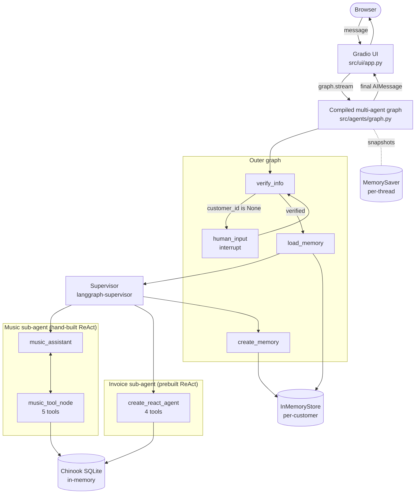
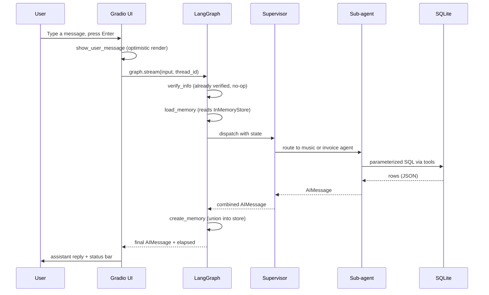
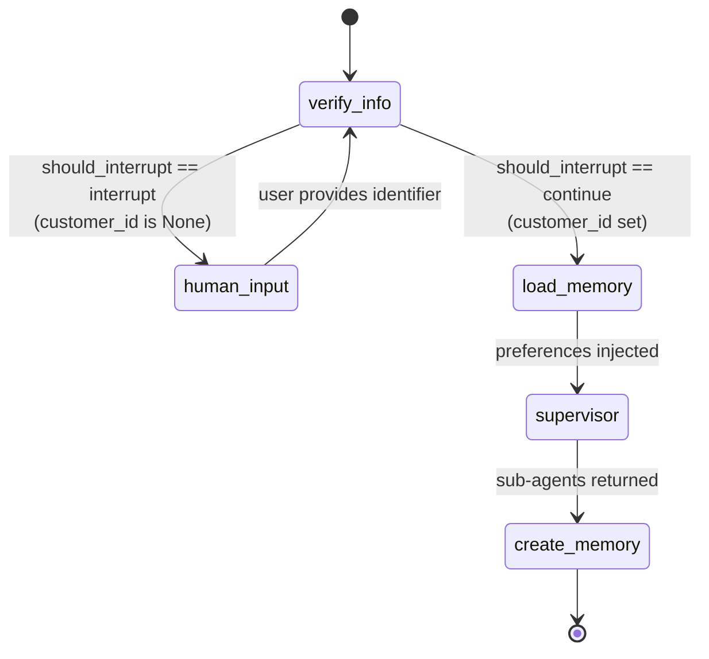
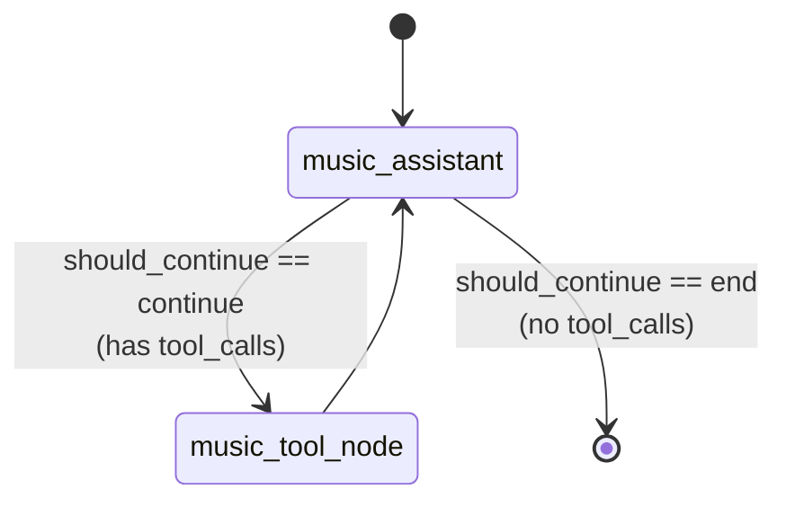

# Architecture

This document explains how the Music Store Multi-Agent Support system is wired end to end. It is written for someone who has already skimmed the README and now wants to understand the moving parts well enough to extend them.

## At a Glance

The system is a hierarchical LangGraph state machine. A single browser request enters the graph at `verify_info`, optionally pauses for identity verification via an `interrupt`, loads any persisted preferences, dispatches to one of two specialized ReAct sub-agents through a supervisor, then records updated memory before returning a response to the Gradio chat UI.

Everything lives in one Python process. The database is an in-memory SQLite copy of the Chinook sample dataset. Both the per-thread checkpointer and the per-customer memory store are in-memory only, which is appropriate for a teaching project and easy to swap for persistent backends later.

## High-Level Flowchart

The outer graph is deterministic: the user always enters at `verify_info`, and once verified, the sequence `load_memory -> supervisor -> create_memory` runs to completion before the next user turn.

## Sequence: One Verified User Turn

The very first turn for a session is different: `verify_info` does not find a `customer_id`, the conditional edge routes to `human_input`, the graph emits a LangGraph `interrupt`, and the Gradio handler reads `snapshot.next` to know that it should display a waiting state and wait for the next user message.

## State Machine

The music sub-agent is its own small state machine inside this one:

## What Lives Where

| Concern | File | Notes |
|---|---|---|
| Process entry point | `app.py:1-19` | Picks between local dev (`__main__`) and Hugging Face Spaces (module import) |
| Settings and logging | `src/config.py:1-29` | `Settings` reads env once; basic stdout logger |
| Shared state contract | `src/state.py:1-12` | `TypedDict` with `add_messages` reducer on `messages` |
| Pydantic schemas | `src/models.py:1-21` | `UserInput`, `UserProfile` |
| Database engine | `src/db/database.py:13-67` | Lazy-built in-memory SQLite, `StaticPool` connection |
| SQL execution helper | `src/db/database.py:70-86` | `run_query_safe` always uses `text()` + bound params |
| Phone normalization | `src/db/database.py:89-95` | Preserves `+`, strips other non-digits |
| DB health check | `src/db/database.py:98-107` | `verify_database()` |
| Music tools (5) | `src/tools/music_catalog.py:18-238` | Albums, tracks, songs by genre, song search, track details |
| Invoice tools (4) | `src/tools/invoice.py:18-146` | Invoices by date, line items by price, employee lookup, line items |
| Graph builder | `src/agents/graph.py:26-129` | Assembles music subgraph, invoice ReAct, supervisor, outer graph |
| Verification node | `src/agents/nodes.py:114-158` | Structured extraction + DB lookup |
| Identifier-to-customer lookup | `src/agents/nodes.py:24-66` | Numeric, email, normalized phone |
| Memory load | `src/agents/nodes.py:166-181` | Reads `("memory_profile", customer_id)` |
| Memory save | `src/agents/nodes.py:184-234` | Set union, skips on empty result |
| Music assistant LLM node | `src/agents/nodes.py:79-97` | Binds tools, calls LLM |
| Routing helpers | `src/agents/nodes.py:100-111` | `should_continue`, `should_interrupt` |
| All system prompts | `src/agents/prompts.py:1-156` | One source of truth for behavior contracts |
| Gradio UI | `src/ui/app.py:1-262` | Streaming handler, status bar, reset button |
| UI styles | `src/ui/styles.py:1-46` | Custom CSS |

## Trust Boundaries

The system distinguishes three trust tiers:

1. **Untrusted input.** Anything inside the user's `HumanMessage` content. Includes the identifier the user types and any later question. The structured-output schema on `verify_info` and the parameterized SQL on every tool exist precisely to keep this content out of code paths where it would matter.
2. **Verified state.** The `customer_id` field on `State`. It is written exactly once by `verify_info` after a successful database lookup. The invoice sub-agent reads it from a dedicated `SystemMessage` rather than from user text, and the prompt explicitly tells the agent to ignore any customer ID the user might mention in conversation.
3. **System internals.** The LLM-bound tools and the SQL engine. Tools are the only path to the database. The supervisor and the verifier never execute SQL directly except through the dedicated lookup helpers in `nodes.py`.

If you add a new sub-agent or a new tool, make sure it does not extend the trust surface: tools should take typed parameters validated by `_safe_int` for numerics, and any code path that needs `customer_id` should read it from `state["customer_id"]` rather than parsing the user message.

## Architectural Invariants

- Only `verify_info` writes `customer_id`. No other node or tool mutates it.
- Only tools execute SQL against the Chinook database.
- `create_memory` is a set union; it never deletes existing preferences. Empty LLM output with a non-empty existing profile skips the write.
- The supervisor merges sub-agent outputs without inventing new facts. Routing rules are encoded in `SUPERVISOR_PROMPT`.
- Every browser session has a UUID `thread_id` stored in `gr.State`. The checkpointer is scoped per thread, so two concurrent users cannot observe each other's state.

## Performance Notes

- The LLM call latency dominates response time. Tools execute in single-digit milliseconds against the in-memory SQLite database.
- `get_songs_by_genre` is the most expensive query because it uses a CTE with `ROW_NUMBER()` to keep the sample deterministic. On the Chinook dataset (3,503 tracks, 25 genres) it still returns in under 5 ms.
- `get_customer_id_from_identifier` scans the `Customer` table once when matching a phone number (because phone formats vary). For 59 customers this is fine; for a real customer table you would want a normalized-phone index.
- Both the checkpointer and the long-term store are in-memory. Restarting the process loses all state.

## Roadmap

These items are tracked in the project README and repeated here so the architecture document stays self-contained.

- Swap `MemorySaver` for `SqliteSaver` or a Postgres-backed checkpointer to survive restarts.
- Swap `InMemoryStore` for a persistent store such as Postgres or Redis.
- Stream tokens to the UI instead of streaming at node-event granularity.
- Expose the Playlist and Customer-Profile tables as new tools.
- Add structured JSON logs with correlation IDs per `thread_id` and per-tool latency metrics.
- Add per-session rate limiting at the UI boundary.
